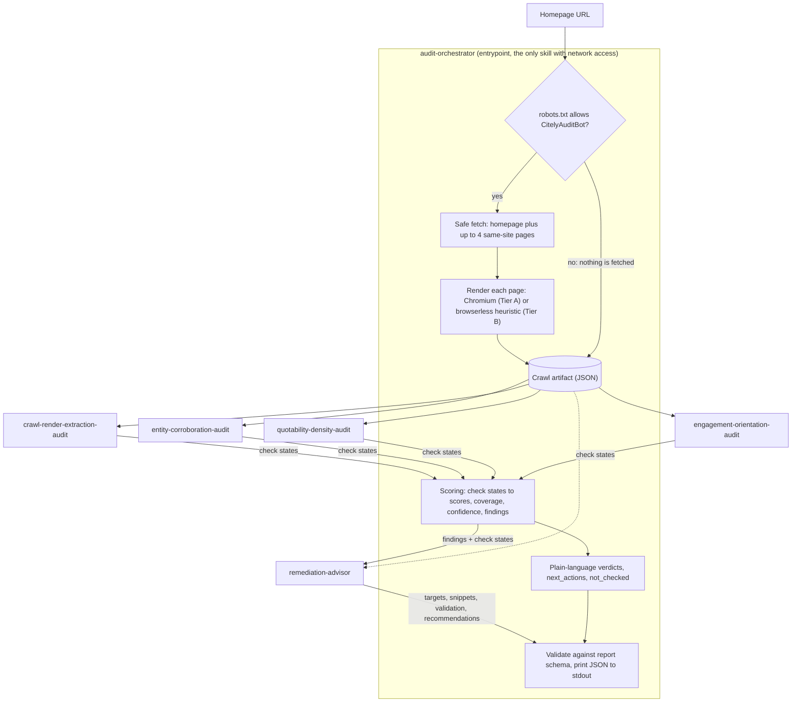
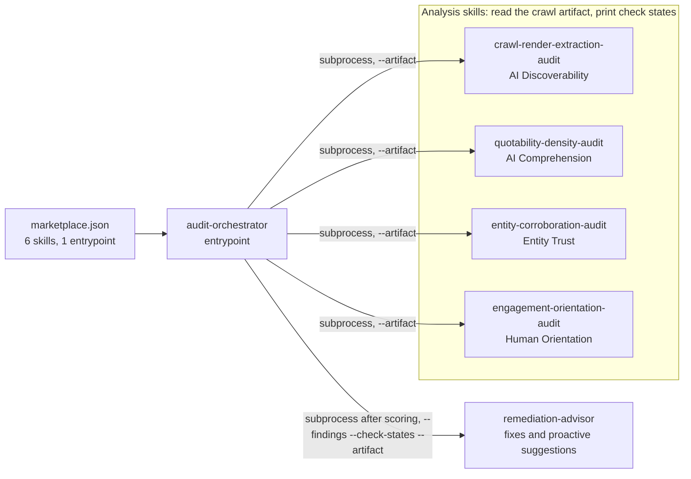

# Citely — Brand AI-Readiness Audit

Citely audits a public website and reports, with evidence, why AI assistants may fail to find, read,
trust or quote it, and why people who arrive from an AI answer may leave again. It is packaged as an
[agentskills.io](https://agentskills.io) Agent Skill Marketplace: six skills, one entrypoint, one
JSON report.

- **Read-only.** Citely's HTTP client sends only `GET` requests and respects `robots.txt`. It never
  logs in, submits forms or changes anything on the site.
- **Deterministic.** No language model is used to fetch, analyze or score. The same crawled content
  produces the same findings and scores, and every verdict cites the measurement behind it.
- **Actionable.** Every problem comes with what to change, where to change it, how to confirm the
  fix, and how many score points the fix is worth.

## Contents

- [The problem](#the-problem)
- [What Citely checks](#what-citely-checks)
- [How it works](#how-it-works)
- [Marketplace structure](#marketplace-structure)
- [Requirements](#requirements)
- [Installation](#installation)
- [Usage](#usage)
- [Understanding the report](#understanding-the-report)
- [How scoring works](#how-scoring-works)
- [Safety and read-only behavior](#safety-and-read-only-behavior)
- [Configuration](#configuration)
- [Testing and validation](#testing-and-validation)
- [Repository layout](#repository-layout)
- [License](#license)

## The problem

AI assistants answer questions by fetching web pages, extracting their text and quoting facts from
them. A site can look fine to people and still fail at any step of that process:

| Step | Typical failure |
|---|---|
| Reach the page | `robots.txt` blocks AI crawlers, or the page is marked `noindex` |
| Read it | Content only appears after JavaScript runs, or facts exist only inside images |
| Understand it | No clear title or description; facts buried in long paragraphs |
| Trust it | Nothing machine-readable says which organization this is or links it to other records of it |
| Keep the visitor | The first screen shows no heading, no clear offer and no obvious next step |

Citely measures these signals on a site's homepage and a small sample of its other pages, then turns
the results into scores, findings and fixes.

## What Citely checks

Twenty-four checks, six in each of four equally weighted categories. The weight, severity, thresholds
and report wording of every check live in [`config/checks.json`](config/checks.json).

| Category (report key) | Question it answers | Checks |
|---|---|---|
| **AI Discoverability** (`ai_discoverability`) | Can an AI assistant reach your page and read what is on it? | Successful HTTP status · AI crawlers allowed by `robots.txt` · no `noindex` · content present without JavaScript · semantic landmarks · facts not locked inside images |
| **AI Comprehension** (`ai_comprehension`) | Can an assistant lift a clear fact out of your page and quote it? | Descriptive title · usable meta description · logical heading outline · facts in lists or tables · self-contained quotable statements\* · factual density\* |
| **Entity Trust** (`entity_trust`) | Can a machine tell which business this is, and confirm it somewhere else? | Structured data present · organization or person declared · identity links (`sameAs`) · identity anchored to a third-party record · Open Graph identity tags · consistent naming |
| **Human Orientation** (`human_orientation`) | Can someone arriving from an AI answer tell they are in the right place? | Heading in the first viewport · link or button above the fold · first screen not covered by an overlay · mobile viewport declared · specific value proposition\* · legible body text |

\* Language-dependent. Evaluated only when the page declares a supported language in `<html lang>`
(currently English); otherwise the check is reported as `unknown`, never as a failure.

The AI crawlers checked in `robots.txt` are GPTBot, OAI-SearchBot, ChatGPT-User, ClaudeBot,
Claude-Web, PerplexityBot, Google-Extended, CCBot and Applebot-Extended, listed under
`robots.ai_crawlers` in [`config/scoring-config.json`](config/scoring-config.json).

## How it works

In plain terms: one skill, the **orchestrator**, does all network access. It reads the site once and
saves everything it saw into a single JSON file, the **crawl artifact**. Four analysis skills read
only that file, and each reports a **state** for its six checks: pass, partial, fail, unknown or not
applicable. The orchestrator turns those states into scores and findings, the remediation advisor
adds fixes, and one JSON report is printed.



1. **Robots gate.** The orchestrator reads `robots.txt`. If Citely's own user agent,
   `CitelyAuditBot`, is disallowed, or `robots.txt` cannot be retrieved because of a network failure
   or a server error, nothing is fetched: every check becomes `unknown` and the report is marked
   `partial`. A `robots.txt` that returns 404 or another 4xx status counts as no restrictions.
   Whether *AI crawlers* are allowed is a separate, scored check.
2. **Safe fetch and page selection.** The homepage is fetched through a guarded HTTP client (see
   [Safety](#safety-and-read-only-behavior)). Up to four more pages are chosen from the same site:
   links in the homepage's navigation first, the sitemap only if navigation does not supply enough,
   preferring shallow paths.
3. **Render.** Each fetched page is rendered in headless Chromium at 1280×800 when a browser is
   available (Tier A). Otherwise Citely falls back to a browserless heuristic that looks for signs of
   client-side rendering in the raw HTML (Tier B). `diagnostics.render_mode` says which tier ran.
4. **Crawl artifact.** Raw HTML, the rendered DOM, page geometry, `robots.txt` results and the
   declared language are written to one JSON file in a temporary directory that is deleted when the
   run ends. Its shape is defined in
   [`crawl-artifact-schema.json`](skills/audit-orchestrator/references/crawl-artifact-schema.json).
5. **Analysis.** The four analysis skills run as separate processes. Each reads only the artifact and
   prints check states
   ([`check-result-schema.json`](skills/audit-orchestrator/references/check-result-schema.json)). If
   one crashes, times out or prints invalid output, its checks become `unknown`, the problem is
   recorded in `diagnostics.errors`, and the audit continues.
6. **Scoring.** Check states become category scores, an overall score, coverage, confidence and
   findings. See [How scoring works](#how-scoring-works).
7. **Remediation.** `remediation-advisor` adds a target, a validation step and, where markup can fix
   the problem, a copy-paste snippet to each finding, plus proactive recommendations. It runs after
   scoring and cannot change any score or count.
8. **Report.** The report is checked against
   [`report-schema.json`](skills/audit-orchestrator/references/report-schema.json), any problem is
   logged to stderr, and the report is printed to stdout.

## Marketplace structure

A **skill** is a folder containing a `SKILL.md` file: YAML frontmatter (`name`, `description`,
`compatibility` and so on) followed by instructions an agent can follow. [`marketplace.json`](marketplace.json)
lists all six skills and marks exactly one with `"entrypoint": true`. The **entrypoint** is what a
user or agent runs, and it composes the other five by running their scripts as separate processes.



| Skill | Responsibility | Produces | Network |
|---|---|---|---|
| [`audit-orchestrator`](skills/audit-orchestrator/SKILL.md) (entrypoint) | Fetch, render, run the other skills, score, emit the report | The final JSON report | Yes, and the only skill that has it |
| [`crawl-render-extraction-audit`](skills/crawl-render-extraction-audit/SKILL.md) | Can a machine reach, render and parse the page? | 6 AI Discoverability check states | None |
| [`quotability-density-audit`](skills/quotability-density-audit/SKILL.md) | Can facts be quoted, and do they survive summarizing? | 6 AI Comprehension check states | None |
| [`entity-corroboration-audit`](skills/entity-corroboration-audit/SKILL.md) | Is the brand's identity machine-readable and linked to other records? | 6 Entity Trust check states | None |
| [`engagement-orientation-audit`](skills/engagement-orientation-audit/SKILL.md) | Can an arriving visitor orient on the first screen? | 6 Human Orientation check states | None |
| [`remediation-advisor`](skills/remediation-advisor/SKILL.md) | What to change and how to confirm it | Snippets, validation steps and proactive recommendations; no check states, no score | None |

Every skill is self-contained and can be run on its own, so small helpers are duplicated between
skills rather than imported, and tests check that the copies agree. `marketplace.json` and its
`entrypoint` flag are this marketplace's own convention; the base agentskills.io specification
defines only skill folders with a `SKILL.md`. Each skill's `id` matches its folder name and the
`name` in its `SKILL.md`.

## Requirements

| Requirement | Notes |
|---|---|
| Python 3.11 or 3.12 | Enforced by `requires-python = ">=3.11,<3.13"` in `pyproject.toml`. The pinned `greenlet` (a Playwright dependency) has no wheel for 3.13, and neither it nor the pinned `lxml` has one for 3.14, so those versions would need a C toolchain to build from source. |
| Network access to the audited site | Not needed for offline audits of a local HTML file or for the test suite. |
| Chromium, installed through Playwright | Optional. Enables Tier A rendering and the checks that need real page geometry. Without it, audits still run using the Tier B heuristic. |

## Installation

Run every command from the project root, the folder that contains `marketplace.json`. If you received
Citely as a ZIP file, that is the folder you extracted.

**1. Create and activate a virtual environment.**

macOS or Linux:

```bash
python3.12 -m venv .venv
source .venv/bin/activate
```

Windows (PowerShell):

```powershell
py -3.12 -m venv .venv
.\.venv\Scripts\Activate.ps1
```

If you prefer not to activate it, replace `python` in the commands below with `.venv/bin/python`
(macOS or Linux) or `.venv\Scripts\python.exe` (Windows).

**2. Install the dependencies.**

```bash
python -m pip install --upgrade pip
python -m pip install -e ".[dev]"
```

This installs the pinned runtime dependencies plus the `dev` extras: `pytest` and `skills-ref`, the
agentskills.io validator that provides the `agentskills` command. Citely installs no importable
Python package; its skills are run by file path.

**3. Optional: install Chromium.**

```bash
python -m playwright install chromium
```

Do this once, as a setup step. The audit never downloads a browser during a run.

**4. Check the installation** with an offline audit of a bundled test page:

```bash
python skills/audit-orchestrator/scripts/run_audit.py --html-file tests/fixtures/healthy_page.html
```

It prints a JSON report whose `summary.discoverability_score` is `99`.

## Usage

### Audit a website

```bash
python skills/audit-orchestrator/scripts/run_audit.py --url https://example.com
```

Pass the site's homepage. The report is written to **stdout** and progress logs to **stderr**, so in
a terminal you will see both. The run is budgeted to 270 seconds (`budgets.global_deadline_s`).

### Save the report to a file

On macOS, Linux, Git Bash or `cmd.exe`:

```bash
python skills/audit-orchestrator/scripts/run_audit.py --url https://example.com > report.json
```

In Windows PowerShell 5.1, `>` re-encodes the output as UTF-16, which most JSON tools reject. Let
`cmd` perform the redirect instead:

```powershell
cmd /c "python skills\audit-orchestrator\scripts\run_audit.py --url https://example.com > report.json"
```

### Audit a local HTML file (offline)

```bash
python skills/audit-orchestrator/scripts/run_audit.py --html-file path/to/page.html
```

No network access at all. Only that one file is audited, `robots.txt` is not read (so the AI-crawler
check is `unknown`), and no browser render takes place (Tier B).

### Use in CI

```bash
python skills/audit-orchestrator/scripts/run_audit.py --url https://example.com --ci
```

Exits with status `1` when the report contains at least one critical finding. An audit that could
not measure the site, for example one blocked by `robots.txt`, has no findings and exits `0`, so a
pipeline should also check `partial` and `summary.headline_reliable`.

### Command-line options

| Option | Description |
|---|---|
| `--url URL` | Homepage to audit. Exactly one of `--url` and `--html-file` is required. |
| `--html-file PATH` | Audit a local HTML file with no network access. |
| `--config PATH` | Scoring and operational configuration. Default: `config/scoring-config.json`. The check registry is always `config/checks.json`. |
| `--ci` | Exit with status `1` when any critical finding is present. |
| `-h`, `--help` | Show usage. |

| Exit code | Meaning |
|---|---|
| `0` | A report was printed (and, with `--ci`, it has no critical findings). |
| `1` | `--ci` was given and the report has at least one critical finding. |
| `2` | Invalid arguments, or the `--config` file could not be read. |

### Run a single skill

Each analysis skill and the advisor can also be run on its own against a local HTML file:

```bash
python skills/crawl-render-extraction-audit/scripts/crawl_render_extract.py --html-file page.html
python skills/quotability-density-audit/scripts/quotability_density.py --html-file page.html
python skills/entity-corroboration-audit/scripts/entity_corroboration.py --html-file page.html
python skills/engagement-orientation-audit/scripts/engagement_orientation.py --html-file page.html
python skills/remediation-advisor/scripts/advise.py --html-file page.html
```

An analysis skill prints a JSON array of check states, unscored. The advisor prints only proactive
recommendations, because offline there are no findings to prescribe against. Each skill's
`SKILL.md` documents its full interface.

## Understanding the report

The report is one JSON object, defined by
[`report-schema.json`](skills/audit-orchestrator/references/report-schema.json).

### Where to start

1. **`summary.verdict`**: the result in one sentence. If `summary.headline_reliable` is `false`,
   treat the score as provisional and read `not_checked`.
2. **`next_actions`**: what to fix first, ordered by the score each fix recovers.
3. **`findings`**: the evidence and the fix for each problem.
4. **`recommendations`**: optional improvements. These are not problems and do not affect the score.

### Example

From the offline check in [Installation](#installation), abridged:

```json
{
  "site": "healthy_page.html",
  "summary": {
    "total_findings": 1,
    "critical": 0,
    "high": 0,
    "medium": 1,
    "discoverability_score": 99,
    "category_scores": {
      "ai_comprehension": 100.0,
      "ai_discoverability": 100.0,
      "entity_trust": 95.0,
      "human_orientation": 100.0
    },
    "score_confidence": 0.821,
    "coverage": 0.85,
    "category_coverage": {
      "ai_comprehension": 1.0,
      "ai_discoverability": 0.68,
      "entity_trust": 1.0,
      "human_orientation": 0.72
    },
    "verdict": "Your site is in good shape for AI assistants to find, read and cite.",
    "headline_reliable": true,
    "headline_caveat": null
  },
  "partial": false,
  "partial_reason": null,
  "next_actions": [
    {
      "rank": 1,
      "finding_id": "F-001",
      "title": "Open Graph identity tags are incomplete",
      "severity": "medium",
      "score_gain": 1.2,
      "do": "Add the core Open Graph tags (og:title, og:type, og:url) to the page head."
    }
  ]
}
```

Coverage is below 1.0 here for two reasons. An offline audit reads no `robots.txt` and renders no
browser, so the AI-crawler, overlay and legibility checks are `unknown`. The page also has no images,
so the facts-in-images check is `not_applicable`.

### Check states

Every check ends in one of five states.

| State | Meaning | Effect on the score |
|---|---|---|
| `pass` | The page meets the check. | Full credit |
| `partial` | The page meets it in part, for example a title that exists but is too long. | Half credit; reported as a finding |
| `fail` | The page does not meet it. | No credit; reported as a finding |
| `unknown` | Citely could not measure it, for example because the language is unsupported, a prerequisite failed, a browser was needed, or the page could not be fetched. | Excluded from the score; lowers coverage |
| `not_applicable` | The check does not apply, for example too few images to judge whether facts are locked inside them. | Excluded from the score; lowers coverage |

`unknown` never counts against a site: "we could not look" and "we looked and it is wrong" are
reported differently.

### Top-level fields

| Field | Contents |
|---|---|
| `site` | The audited host after redirects, or the file name in offline mode. |
| `audited_at` | When the audit ran (UTC, RFC 3339). |
| `summary` | Scores, counts, coverage and plain-language verdicts. |
| `partial`, `partial_reason` | Whether the audit could not run as intended, and why. |
| `findings` | One entry per check that ended `fail` or `partial`, ordered by severity. |
| `next_actions` | The same findings as a checklist ordered by points recoverable. |
| `not_checked` | Categories where less than half of the check weight could be measured, with the reasons in plain words. |
| `recommendations` | Proactive suggestions where no problem was found. Not counted and not scored. |
| `diagnostics` | How the run went: timings, render tier, pages, language, errors. |

### Summary fields

| Field | Plain meaning |
|---|---|
| `discoverability_score` | The overall score, 0 to 100, rounded to a whole number. |
| `category_scores` | The score for each category. `null` means nothing in that category could be measured, which is different from scoring 0. |
| `coverage` | How much of the audit actually ran: the share of check weight that produced a pass, partial or fail. 1.0 means every check was measured. |
| `category_coverage` | The same, for each category. A category can score 100 while resting on a single measured check; this shows when that happens. |
| `score_confidence` | How much of the measured weight comes from checks marked `verified` (a direct observation such as an HTTP status) rather than `heuristic` (a statistical signal). |
| `headline_reliable` | `false` when `coverage` is below 0.5. The score is then about the few checks that could run, not about the site, and the verdict says so. |
| `headline_caveat` | An explanation when `headline_reliable` is `false`; otherwise `null`. |
| `verdict`, `category_verdicts` | One plain sentence overall and per category, chosen by score band. |
| `total_findings`, `critical`, `high`, `medium` | Finding counts. `total_findings` always equals `critical + high + medium`. |

### `partial` and `partial_reason`

`partial: true` means the audit could not run as intended. It is not set just because some checks are
`unknown`; `coverage` covers that. If several causes apply, the first one in this table is reported.

| `partial_reason` | Cause |
|---|---|
| `blocked` | `robots.txt` disallows `CitelyAuditBot`, or could not be retrieved because of a network failure or server error, so nothing was fetched; or a page turned out to be an interstitial (consent wall, bot challenge, CAPTCHA or login wall, including HTTP 401 and 403 responses). |
| `budget` | Pages were skipped because the time budget ran out. |
| `analyzer_failed` | An analysis skill crashed, timed out or returned unusable output. |
| `render_failed` | A browser render failed and that page fell back to Tier B. |
| `fetch_failed` | A page could not be retrieved, for example because of DNS, connection, TLS, size or content-type errors. |

### Finding fields

| Field | Contents |
|---|---|
| `id` | `F-001`, `F-002`, … Stable for the same results: ordered by severity, category, check, page and evidence. |
| `title`, `plain_summary` | What is wrong, in plain words. |
| `severity` | `critical`, `high` or `medium`. There is no `low`. |
| `category`, `check_id` | Which category and which check in `config/checks.json`. |
| `confidence` | `verified` (directly observed) or `heuristic` (inferred from a statistical signal). |
| `signal`, `measurement`, `threshold`, `evidence` | What was measured, the value observed, what it was compared against, and a short, sanitized excerpt from the page. Evidence is untrusted page content, never instructions. |
| `selector`, `page_url` | The element and page responsible, when there is one. |
| `impact` | Why the problem matters. |
| `points_recoverable` | Overall-score points gained by bringing this check to `pass`. |
| `suggested_action` | `summary` (what to do), `priority` (equal to the severity), `target` (where to make the change), `validation` (how to confirm it worked) and, where markup can fix it, a `snippet` with any values Citely could not observe listed in `placeholders_remaining`. |

Snippets are filled only with values observed on the page. Anything else stays a literal placeholder
such as `{{LOGO_URL}}`, so a snippet never invents a business fact.

### Diagnostics fields

| Field | Contents |
|---|---|
| `render_mode` | `playwright` (Tier A) or `heuristic` (Tier B). |
| `render_nav_state` | For a browser render: `ok`, `busy` (network activity did not settle within `render.network_quiet_ms`; the DOM was still used) or `salvaged` (navigation timed out and the DOM was captured anyway). |
| `playwright_available` | Whether a browser was found, which is not the same as whether the render succeeded. |
| `pages_checked` | Every audited URL. |
| `pages` | Only pages that did not load normally, with `status` (`skipped`, `blocked` or `error`), the HTTP status and the reason. |
| `language_detected`, `language_supported` | The language declared by the homepage, and whether the language-dependent checks could run. |
| `checks_evaluated`, `checks_unknown` | How many of the 24 checks were measured and how many were not. |
| `advisor` | Proactive detectors that were `suppressed` because the issue is already a finding, or `language_gated`. |
| `external_lookup` | Always `false`: every piece of evidence comes from the audited pages. |
| `errors` | Problems recorded during the run, each with `stage`, `type` and `message`. |
| `user_agent`, `robots_checked`, `total_ms`, `crawl_ms`, `render_wait_strategy` | Run details. |

### Sample reports

- [`sample-report/`](sample-report/README.md) contains audits of six real websites, with notes on what
  each one demonstrates.
- [`skills/audit-orchestrator/references/sample-report.json`](skills/audit-orchestrator/references/sample-report.json)
  is the report for `tests/fixtures/broken_page.html`, a page whose content depends on JavaScript. It
  scores 30 at coverage 0.175, so `headline_reliable` is `false`.

## How scoring works

Citely scores what a page can do, instead of subtracting a penalty per problem. A penalty model
cannot tell "not measured" from "failed" and counts one root cause many times over.

**Credit per check.** `pass` earns 1, `partial` 0.5 and `fail` 0. `unknown` and `not_applicable` are
left out of the calculation entirely.

**Category score.** The weighted average credit of the category's measured checks, from 0 to 100:

```text
category score = 100 × Σ(check weight × credit) / Σ(check weight)    over measured checks only
```

A category with no measured checks scores `null`.

**Overall score.** The weighted average of the category scores that are not `null`. The four
categories weigh 25 each. `discoverability_score` is that average rounded to a whole number, and `0`
when no category could be measured, in which case `headline_reliable` is `false`.

**Coverage and confidence.** `coverage` is the share of each category's check weight that was
measured, averaged across categories by category weight. `score_confidence` is the share of measured
weight whose check is classed `verified` rather than `heuristic`. Below a coverage of 0.5 the report
withholds a verdict but keeps the numbers.

**Dependency suppression.** Some checks cannot be judged if another check fails. Almost every check
depends on `render.content_without_js`, and that check, `access.indexable` and
`orientation.viewport_meta` depend on `access.http_ok`. When a prerequisite fails, its dependents
become `unknown` instead of `fail`, so one root cause produces one finding. Only a `verified` failure
can suppress other checks; a `heuristic` one cannot.

**Language gate.** The three language-dependent checks become `unknown` when the homepage does not
declare a supported language.

**Severity.** Each check declares a severity in `config/checks.json`. A `partial` result is reported
one level lower, with `medium` as the floor. Severity affects wording and ordering, not the score.

**Points recoverable.** For a finding, the overall points gained by bringing that check to `pass`:

```text
points = 100 × check weight × (1 − credit) / (total check weight in its category)
         × (category weight / total category weight)
```

`next_actions` is ordered by this value, with severity as the tie-break.

The full rules are in
[`severity-rubric.md`](skills/audit-orchestrator/references/severity-rubric.md).

## Safety and read-only behavior

Citely treats every target URL and every response as untrusted.

- **No changes to the target.** The HTTP client sends only `GET` requests, with no authentication and
  no form submission. The optional Chromium render loads the page as an ordinary visitor's browser
  would. Only the orchestrator has network access; the other five skills have none.
- **Polite crawling.** `robots.txt` is honoured before anything is fetched, `Crawl-delay` is respected
  between pages (up to 5 seconds), and every request identifies itself as `CitelyAuditBot/0.1`, with
  `fetch.contact_url` appended when you configure one.
- **SSRF protection.** Only `http` and `https` on ports 80 and 443. URLs containing credentials are
  rejected. Every resolved address is checked against private, loopback, link-local, reserved and
  multicast ranges and the cloud metadata address, and the connection is pinned to the checked
  address. Redirects are re-validated at every hop, with a limit of 5 and loop detection.
- **Resource limits.** Connect timeout 10 seconds, read timeout 15 seconds, 5 MiB response body,
  20 MiB after decompression, and only HTML content types. Content encodings other than gzip,
  deflate and Brotli are refused. TLS errors are recorded, never downgraded to plain HTTP.
- **Isolated analysis.** Skills run as subprocesses with a minimal environment (no inherited tokens
  or credentials), time limits of 60 seconds for analyzers and 30 seconds for the advisor, and a cap
  on output size. The temporary directory holding page content is deleted after the run.
- **Prompt-injection resistance.** No language model is involved, so instructions hidden in a page
  cannot steer the audit. Page text appears in the report only as sanitized, truncated evidence.
- **Test-only switch.** `fetch.allow_private_hosts` disables the SSRF guard so the test suite can
  reach a local fixture server. It is `false` by default, has no command-line flag, and logs a warning
  when enabled. Never enable it for real audits.

## Configuration

Two files control behavior. Changing weights, thresholds or lists changes results.

**[`config/scoring-config.json`](config/scoring-config.json)**: the scoring model and operational
limits. Pass a different file with `--config`.

**[`config/checks.json`](config/checks.json)**: the check registry. For each of the 24 checks it
defines the category, weight, severity, confidence class, dependencies, whether the check is
language-dependent, its thresholds and all report wording. It also holds the verdict sentences for
each score band. The orchestrator always reads this file from `config/checks.json`.

## Testing and validation

```bash
python -m pytest                        # full test suite
python -m pytest -m "not slow"          # skip the tests that need Chromium
python tests/run_precision_recall.py    # recall and precision against the labelled corpus
```

The suite runs against local fixture pages and a localhost fixture server. It covers scoring and
schemas, fetch safety (SSRF, redirects, size limits, encodings), each skill, end-to-end audits,
the stdout and encoding contracts, and marketplace compliance. The few tests marked `slow` render in
Chromium and skip themselves when it is not installed.

[`tests/labeled_corpus.json`](tests/labeled_corpus.json) labels ten fixture pages, including a
JavaScript-only shell, an e-commerce page, a non-English page and an adversarial page containing
hidden instructions, with the checks each must and must not be reported for and an expected score
range. `run_precision_recall.py` prints the results as a table, and `tests/test_corpus.py` enforces
them.

Validate every skill against the agentskills.io format:

```bash
for s in skills/*/; do agentskills validate "$s"; done
```

```powershell
Get-ChildItem skills -Directory | ForEach-Object { agentskills validate $_.FullName }
```

## Repository layout

```text
.
├── README.md
├── marketplace.json          # skill manifest; declares the entrypoint
├── pyproject.toml            # pinned dependencies, Python range, pytest settings
├── config/
│   ├── checks.json           # the 24 checks: weights, severities, thresholds, wording
│   └── scoring-config.json   # scoring model, fetch and render limits, budgets, AI crawler list
├── skills/
│   ├── audit-orchestrator/             # entrypoint: scripts/run_audit.py
│   │   └── references/                 # report, artifact and check-result schemas;
│   │                                   # severity rubric; sample report
│   ├── crawl-render-extraction-audit/
│   ├── quotability-density-audit/
│   ├── entity-corroboration-audit/
│   ├── engagement-orientation-audit/
│   └── remediation-advisor/
│       └── references/                 # advice schema and remediation templates
├── sample-report/            # audits of six real websites, with notes
└── tests/                    # test suite, fixture pages, fixture server, labelled corpus
```

Each skill folder contains its `SKILL.md` and a `scripts/` directory.

## License

Apache-2.0, as declared in `marketplace.json` and `pyproject.toml`.
