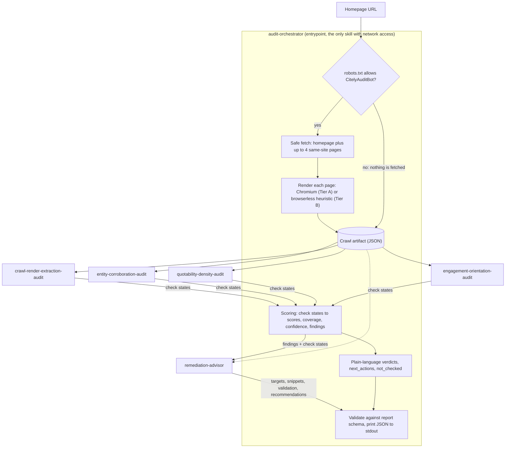
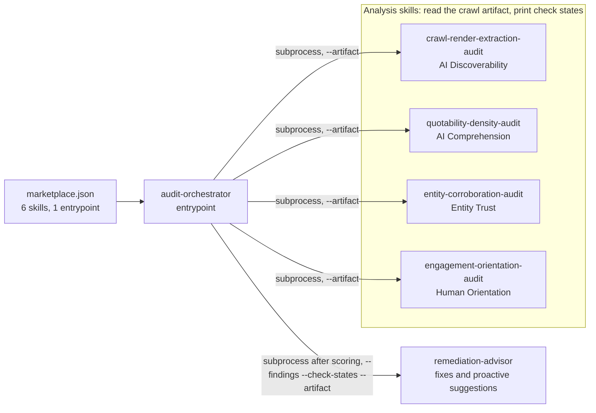

# Citely — Brand AI-Readiness Audit

Citely audits a public website and reports, with evidence, why AI assistants may fail to find, read,
trust or quote it, and why people who arrive from an AI answer may leave again. It is packaged as an
[agentskills.io](https://agentskills.io) Agent Skill Marketplace: six skills, one entrypoint, one
JSON report.

- **Read-only.** Citely's HTTP client sends only `GET` requests and respects `robots.txt`. It never
  logs in, submits forms or changes anything on the site.
- **Deterministic.** No language model is used to fetch, analyze or score. The same crawled content
  produces the same findings and scores, and every verdict cites the measurement behind it.
- **Actionable.** Every problem comes with what to change, where to change it, how to confirm the
  fix, and how many score points the fix is worth.

## Contents

- [The problem](#the-problem)
- [What Citely checks](#what-citely-checks)
- [How it works](#how-it-works)
- [Marketplace structure](#marketplace-structure)
- [Requirements](#requirements)
- [Installation](#installation)
- [Usage](#usage)
- [Understanding the report](#understanding-the-report)
- [How scoring works](#how-scoring-works)
- [Safety and read-only behavior](#safety-and-read-only-behavior)
- [Configuration](#configuration)
- [Testing and validation](#testing-and-validation)
- [Repository layout](#repository-layout)
- [License](#license)

## The problem

AI assistants answer questions by fetching web pages, extracting their text and quoting facts from
them. A site can look fine to people and still fail at any step of that process:

| Step | Typical failure |
|---|---|
| Reach the page | `robots.txt` blocks AI crawlers, or the page is marked `noindex` |
| Read it | Content only appears after JavaScript runs, or facts exist only inside images |
| Understand it | No clear title or description; facts buried in long paragraphs |
| Trust it | Nothing machine-readable says which organization this is or links it to other records of it |
| Keep the visitor | The first screen shows no heading, no clear offer and no obvious next step |

Citely measures these signals on a site's homepage and a small sample of its other pages, then turns
the results into scores, findings and fixes.

## What Citely checks

Twenty-four checks, six in each of four equally weighted categories. The weight, severity, thresholds
and report wording of every check live in [`config/checks.json`](config/checks.json).

| Category (report key) | Question it answers | Checks |
|---|---|---|
| **AI Discoverability** (`ai_discoverability`) | Can an AI assistant reach your page and read what is on it? | Successful HTTP status · AI crawlers allowed by `robots.txt` · no `noindex` · content present without JavaScript · semantic landmarks · facts not locked inside images |
| **AI Comprehension** (`ai_comprehension`) | Can an assistant lift a clear fact out of your page and quote it? | Descriptive title · usable meta description · logical heading outline · facts in lists or tables · self-contained quotable statements\* · factual density\* |
| **Entity Trust** (`entity_trust`) | Can a machine tell which business this is, and confirm it somewhere else? | Structured data present · organization or person declared · identity links (`sameAs`) · identity anchored to a third-party record · Open Graph identity tags · consistent naming |
| **Human Orientation** (`human_orientation`) | Can someone arriving from an AI answer tell they are in the right place? | Heading in the first viewport · link or button above the fold · first screen not covered by an overlay · mobile viewport declared · specific value proposition\* · legible body text |

\* Language-dependent. Evaluated only when the page declares a supported language in `<html lang>`
(currently English); otherwise the check is reported as `unknown`, never as a failure.

The AI crawlers checked in `robots.txt` are GPTBot, OAI-SearchBot, ChatGPT-User, ClaudeBot,
Claude-Web, PerplexityBot, Google-Extended, CCBot and Applebot-Extended, listed under
`robots.ai_crawlers` in [`config/scoring-config.json`](config/scoring-config.json).

## How it works

In plain terms: one skill, the **orchestrator**, does all network access. It reads the site once and
saves everything it saw into a single JSON file, the **crawl artifact**. Four analysis skills read
only that file, and each reports a **state** for its six checks: pass, partial, fail, unknown or not
applicable. The orchestrator turns those states into scores and findings, the remediation advisor
adds fixes, and one JSON report is printed.



1. **Robots gate.** The orchestrator reads `robots.txt`. If Citely's own user agent,
   `CitelyAuditBot`, is disallowed, or `robots.txt` cannot be retrieved because of a network failure
   or a server error, nothing is fetched: every check becomes `unknown` and the report is marked
   `partial`. A `robots.txt` that returns 404 or another 4xx status counts as no restrictions.
   Whether *AI crawlers* are allowed is a separate, scored check.
2. **Safe fetch and page selection.** The homepage is fetched through a guarded HTTP client (see
   [Safety](#safety-and-read-only-behavior)). Up to four more pages are chosen from the same site:
   links in the homepage's navigation first, the sitemap only if navigation does not supply enough,
   preferring shallow paths.
3. **Render.** Each fetched page is rendered in headless Chromium at 1280×800 when a browser is
   available (Tier A). Otherwise Citely falls back to a browserless heuristic that looks for signs of
   client-side rendering in the raw HTML (Tier B). `diagnostics.render_mode` says which tier ran.
4. **Crawl artifact.** Raw HTML, the rendered DOM, page geometry, `robots.txt` results and the
   declared language are written to one JSON file in a temporary directory that is deleted when the
   run ends. Its shape is defined in
   [`crawl-artifact-schema.json`](skills/audit-orchestrator/references/crawl-artifact-schema.json).
5. **Analysis.** The four analysis skills run as separate processes. Each reads only the artifact and
   prints check states
   ([`check-result-schema.json`](skills/audit-orchestrator/references/check-result-schema.json)). If
   one crashes, times out or prints invalid output, its checks become `unknown`, the problem is
   recorded in `diagnostics.errors`, and the audit continues.
6. **Scoring.** Check states become category scores, an overall score, coverage, confidence and
   findings. See [How scoring works](#how-scoring-works).
7. **Remediation.** `remediation-advisor` adds a target, a validation step and, where markup can fix
   the problem, a copy-paste snippet to each finding, plus proactive recommendations. It runs after
   scoring and cannot change any score or count.
8. **Report.** The report is checked against
   [`report-schema.json`](skills/audit-orchestrator/references/report-schema.json), any problem is
   logged to stderr, and the report is printed to stdout.

## Marketplace structure

A **skill** is a folder containing a `SKILL.md` file: YAML frontmatter (`name`, `description`,
`compatibility` and so on) followed by instructions an agent can follow. [`marketplace.json`](marketplace.json)
lists all six skills and marks exactly one with `"entrypoint": true`. The **entrypoint** is what a
user or agent runs, and it composes the other five by running their scripts as separate processes.



| Skill | Responsibility | Produces | Network |
|---|---|---|---|
| [`audit-orchestrator`](skills/audit-orchestrator/SKILL.md) (entrypoint) | Fetch, render, run the other skills, score, emit the report | The final JSON report | Yes, and the only skill that has it |
| [`crawl-render-extraction-audit`](skills/crawl-render-extraction-audit/SKILL.md) | Can a machine reach, render and parse the page? | 6 AI Discoverability check states | None |
| [`quotability-density-audit`](skills/quotability-density-audit/SKILL.md) | Can facts be quoted, and do they survive summarizing? | 6 AI Comprehension check states | None |
| [`entity-corroboration-audit`](skills/entity-corroboration-audit/SKILL.md) | Is the brand's identity machine-readable and linked to other records? | 6 Entity Trust check states | None |
| [`engagement-orientation-audit`](skills/engagement-orientation-audit/SKILL.md) | Can an arriving visitor orient on the first screen? | 6 Human Orientation check states | None |
| [`remediation-advisor`](skills/remediation-advisor/SKILL.md) | What to change and how to confirm it | Snippets, validation steps and proactive recommendations; no check states, no score | None |

Every skill is self-contained and can be run on its own, so small helpers are duplicated between
skills rather than imported, and tests check that the copies agree. `marketplace.json` and its
`entrypoint` flag are this marketplace's own convention; the base agentskills.io specification
defines only skill folders with a `SKILL.md`. Each skill's `id` matches its folder name and the
`name` in its `SKILL.md`.

## Requirements

| Requirement | Notes |
|---|---|
| Python 3.11 or 3.12 | Enforced by `requires-python = ">=3.11,<3.13"` in `pyproject.toml`. The pinned `greenlet` (a Playwright dependency) has no wheel for 3.13, and neither it nor the pinned `lxml` has one for 3.14, so those versions would need a C toolchain to build from source. |
| Network access to the audited site | Not needed for offline audits of a local HTML file or for the test suite. |
| Chromium, installed through Playwright | Optional. Enables Tier A rendering and the checks that need real page geometry. Without it, audits still run using the Tier B heuristic. |

## Installation

Run every command from the project root, the folder that contains `marketplace.json`. If you received
Citely as a ZIP file, that is the folder you extracted.

**1. Create and activate a virtual environment.**

macOS or Linux:

```bash
python3.12 -m venv .venv
source .venv/bin/activate
```

Windows (PowerShell):

```powershell
py -3.12 -m venv .venv
.\.venv\Scripts\Activate.ps1
```

If you prefer not to activate it, replace `python` in the commands below with `.venv/bin/python`
(macOS or Linux) or `.venv\Scripts\python.exe` (Windows).

**2. Install the dependencies.**

```bash
python -m pip install --upgrade pip
python -m pip install -e ".[dev]"
```

This installs the pinned runtime dependencies plus the `dev` extras: `pytest` and `skills-ref`, the
agentskills.io validator that provides the `agentskills` command. Citely installs no importable
Python package; its skills are run by file path.

**3. Optional: install Chromium.**

```bash
python -m playwright install chromium
```

Do this once, as a setup step. The audit never downloads a browser during a run.

**4. Check the installation** with an offline audit of a bundled test page:

```bash
python skills/audit-orchestrator/scripts/run_audit.py --html-file tests/fixtures/healthy_page.html
```

It prints a JSON report whose `summary.discoverability_score` is `99`.

## Usage

Run commands from the project root. The report is written to **stdout** and logs to **stderr**.

```bash
python skills/audit-orchestrator/scripts/run_audit.py --url https://example.com                # audit a website
python skills/audit-orchestrator/scripts/run_audit.py --url https://example.com > report.json  # save the report
python skills/audit-orchestrator/scripts/run_audit.py --html-file path/to/page.html             # offline audit
python skills/audit-orchestrator/scripts/run_audit.py --url https://example.com --ci           # CI gate
```

| Option or case | Details |
|---|---|
| `--url` / `--html-file` | Exactly one is required. A URL audit is budgeted to 270 seconds. `--html-file` audits one file without reading `robots.txt` (the AI-crawler check is `unknown`) or rendering in a browser (Tier B). |
| Saving the report | `>` works in macOS, Linux, Git Bash and `cmd.exe`. Windows PowerShell 5.1 saves UTF-16, which JSON tools reject; use `cmd /c "python skills\audit-orchestrator\scripts\run_audit.py --url https://example.com > report.json"`. |
| `--ci` | Exits `1` when any critical finding is present. An audit that could not measure the site (for example, blocked by `robots.txt`) has no findings and exits `0`, so also check `partial` and `summary.headline_reliable`. |
| `--config PATH` | Alternative scoring configuration (default `config/scoring-config.json`). The check registry is always `config/checks.json`. |
| Exit codes | `0` report printed · `1` `--ci` and a critical finding · `2` invalid arguments or unreadable `--config` |
| One skill on its own | `python skills/<skill>/scripts/<script>.py --html-file page.html`, where the script is `crawl_render_extract.py`, `quotability_density.py`, `entity_corroboration.py`, `engagement_orientation.py` or `advise.py`. Analysis skills print unscored check states; the advisor prints proactive recommendations only. |

## Understanding the report

The report is one JSON object, defined by
[`report-schema.json`](skills/audit-orchestrator/references/report-schema.json).

### Where to start

1. **`summary.verdict`**: the result in one sentence. If `summary.headline_reliable` is `false`,
   treat the score as provisional and read `not_checked`.
2. **`next_actions`**: what to fix first, ordered by the score each fix recovers.
3. **`findings`**: the evidence and the fix for each problem.
4. **`recommendations`**: optional improvements. These are not problems and do not affect the score.

### Check states

| State | Meaning | Effect |
|---|---|---|
| `pass`, `partial`, `fail` | Met; met in part (for example, a title that exists but is too long); not met | Credit 1, 0.5 or 0; `partial` and `fail` become findings |
| `unknown` | Not measurable: unsupported language, failed prerequisite, no browser, or page not fetched | Excluded from the score, so it never counts against a site; lowers coverage |
| `not_applicable` | Does not apply, for example too few images to judge | Excluded from the score; lowers coverage |

### Report fields

| Field | Meaning |
|---|---|
| `site`, `audited_at` | Audited host after redirects (the file name offline) and the UTC run time |
| `summary.verdict`, `summary.category_verdicts` | One plain sentence overall and per category |
| `summary.discoverability_score`, `summary.category_scores` | Overall score from 0 to 100 and per-category scores; `null` means nothing was measurable, not 0 |
| `summary.coverage`, `summary.category_coverage` | Share of check weight actually measured (1.0 = every check), which shows when a score rests on few checks |
| `summary.score_confidence` | Share of measured weight from `verified` (directly observed) rather than `heuristic` (statistical) checks |
| `summary.headline_reliable`, `summary.headline_caveat` | `false`, with an explanation, when coverage is below 0.5: treat the score as provisional |
| `summary.total_findings`, `critical`, `high`, `medium` | Finding counts; the total always equals `critical + high + medium` |
| `findings[]` | One per `fail` or `partial` check, ordered by severity (`F-001`, …): `title`, `plain_summary`, `severity` (`critical`, `high` or `medium`), `category`, `check_id`, `confidence`, `signal`, `measurement`, `threshold`, `evidence` (sanitized, untrusted page text), `selector`, `page_url`, `impact`, `points_recoverable` |
| `findings[].suggested_action` | `summary`, `priority` (equal to the severity), `target`, `validation` and, where markup can fix it, a `snippet`; values not observed on the page stay placeholders such as `{{LOGO_URL}}`, listed in `placeholders_remaining` |
| `next_actions[]` | The same findings as a checklist ranked by `score_gain` |
| `not_checked[]` | Categories with coverage below 0.5, with plain-language reasons |
| `recommendations[]` | Proactive suggestions; not counted and not scored |
| `diagnostics` | `render_mode` (`playwright` or `heuristic`); `render_nav_state` (`ok`, `busy` = network did not settle in time, `salvaged` = navigation timed out and the DOM was kept); `pages_checked`; `pages` (only skipped, blocked or failed pages); `language_detected`, `language_supported`; `checks_evaluated`, `checks_unknown`; `advisor` (suppressed or language-gated detectors); `external_lookup` (always `false`); `errors` |

### `partial` and `partial_reason`

`partial: true` means the audit could not run as intended. If several reasons apply, the first wins:

| `partial_reason` | Cause |
|---|---|
| `blocked` | `robots.txt` disallows `CitelyAuditBot` or cannot be retrieved (network failure or server error), or a page is a consent wall, bot challenge, CAPTCHA or login wall (including HTTP 401 and 403) |
| `budget` | Pages were skipped when the time budget ran out |
| `analyzer_failed` | An analysis skill crashed, timed out or returned unusable output |
| `render_failed` | A browser render failed and the page fell back to Tier B |
| `fetch_failed` | A page could not be retrieved (DNS, connection, TLS, size or content-type errors) |

### Sample reports

- [`sample-report/`](sample-report/README.md) contains audits of six real websites, with notes on what
  each one demonstrates.
- [`skills/audit-orchestrator/references/sample-report.json`](skills/audit-orchestrator/references/sample-report.json)
  is the report for `tests/fixtures/broken_page.html`, a page whose content depends on JavaScript. It
  scores 30 at coverage 0.175, so `headline_reliable` is `false`.

## How scoring works

```text
check credit    pass = 1, partial = 0.5, fail = 0; unknown and not_applicable are excluded
category score  100 × Σ(check weight × credit) / Σ(check weight), measured checks only; null if none
overall score   weighted mean of non-null category scores (25 each), rounded; 0 if none is measurable
points          100 × check weight × (1 − credit) / (category check weight) × (category weight / Σ category weights)
```

| Rule | Effect |
|---|---|
| Coverage and confidence | `coverage` is the measured share of each category's check weight, averaged by category weight; `score_confidence` is the share of measured weight from `verified` checks. Below 0.5 coverage the verdict is withheld and the numbers are kept. |
| Dependency suppression | Almost every check depends on `render.content_without_js`, which, like `access.indexable` and `orientation.viewport_meta`, depends on `access.http_ok`. A `verified` prerequisite failure turns its dependents `unknown` instead of `fail`, so one root cause yields one finding; a `heuristic` failure suppresses nothing. |
| Language gate | The three language-dependent checks are `unknown` unless the homepage declares a supported language. |
| Severity | Declared per check in `config/checks.json`; a `partial` is reported one level lower (floor `medium`). It affects wording and order, not the score. |
| Ranking | `next_actions` is ordered by points recoverable, then by severity. Full rules: [`severity-rubric.md`](skills/audit-orchestrator/references/severity-rubric.md). |

## Safety and read-only behavior

| Guarantee | How |
|---|---|
| Read-only | The HTTP client sends only `GET` requests, with no authentication or form submission; the optional Chromium render loads pages like an ordinary browser. Only the orchestrator has network access. |
| Polite crawling | `robots.txt` is honoured before fetching and `Crawl-delay` between pages (up to 5 seconds); requests identify as `CitelyAuditBot/0.1`, plus `fetch.contact_url` when set. |
| SSRF protection | `http` and `https` on ports 80 and 443 only; no credentials in URLs; every resolved address is checked against private, loopback, link-local, reserved and multicast ranges and the cloud metadata address, then pinned; redirects are re-validated at every hop (at most 5, with loop detection). |
| Resource limits | 10-second connect and 15-second read timeouts, 5 MiB body, 20 MiB decompressed, HTML content types only; encodings other than gzip, deflate and Brotli are refused; TLS errors are never downgraded. |
| Isolated analysis | Subprocesses with a minimal environment (no inherited credentials), 60-second (analyzers) and 30-second (advisor) limits and capped output; the temporary artifact directory is deleted after the run. |
| Injection resistance | No language model is involved; page text reaches the report only as sanitized, truncated evidence. |
| Test-only switch | `fetch.allow_private_hosts` disables the SSRF guard for the test suite: `false` by default, no command-line flag, and a warning is logged when enabled. |

## Configuration

Two files control behavior. Changing weights, thresholds or lists changes results.

**[`config/scoring-config.json`](config/scoring-config.json)**: the scoring model and operational
limits. Pass a different file with `--config`.

**[`config/checks.json`](config/checks.json)**: the check registry. For each of the 24 checks it
defines the category, weight, severity, confidence class, dependencies, whether the check is
language-dependent, its thresholds and all report wording. It also holds the verdict sentences for
each score band. The orchestrator always reads this file from `config/checks.json`.

## Testing and validation

```bash
python -m pytest                       # full suite; tests marked slow need Chromium and skip without it
python -m pytest -m "not slow"         # skip the browser tests
python tests/run_precision_recall.py   # recall and precision against the labelled corpus
for s in skills/*/; do agentskills validate "$s"; done   # agentskills.io format, all six skills
```

The suite uses local fixture pages and a localhost fixture server, and covers scoring, schemas, fetch
safety, every skill, end-to-end audits and compliance. [`tests/labeled_corpus.json`](tests/labeled_corpus.json)
labels ten fixture pages (including a JavaScript-only shell, a non-English page and a prompt-injection
page) with the checks each must and must not trigger and a score range, enforced by `tests/test_corpus.py`.
On PowerShell, validate with `Get-ChildItem skills -Directory | ForEach-Object { agentskills validate $_.FullName }`.

## Repository layout

```text
.
├── README.md
├── marketplace.json          # skill manifest; declares the entrypoint
├── pyproject.toml            # pinned dependencies, Python range, pytest settings
├── config/
│   ├── checks.json           # the 24 checks: weights, severities, thresholds, wording
│   └── scoring-config.json   # scoring model, fetch and render limits, budgets, AI crawler list
├── skills/
│   ├── audit-orchestrator/             # entrypoint: scripts/run_audit.py
│   │   └── references/                 # report, artifact and check-result schemas;
│   │                                   # severity rubric; sample report
│   ├── crawl-render-extraction-audit/
│   ├── quotability-density-audit/
│   ├── entity-corroboration-audit/
│   ├── engagement-orientation-audit/
│   └── remediation-advisor/
│       └── references/                 # advice schema and remediation templates
├── sample-report/            # audits of six real websites, with notes
└── tests/                    # test suite, fixture pages, fixture server, labelled corpus
```

Each skill folder contains its `SKILL.md` and a `scripts/` directory.

## License

Apache-2.0, as declared in `marketplace.json` and `pyproject.toml`.
